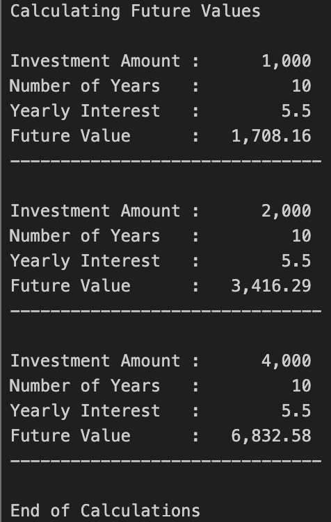
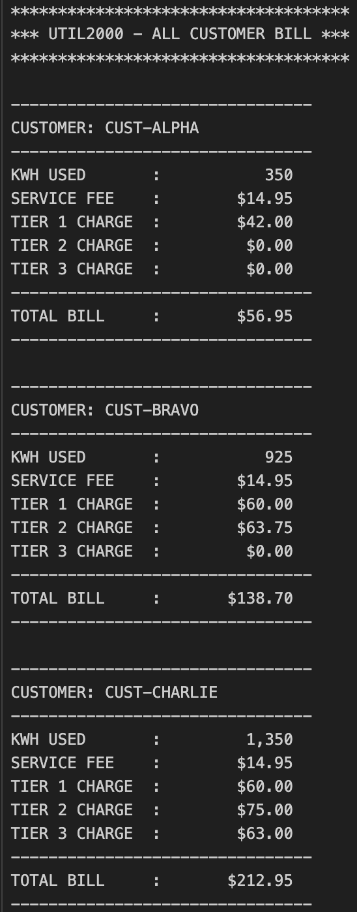
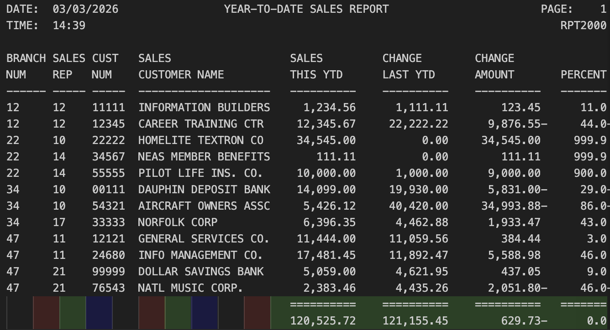
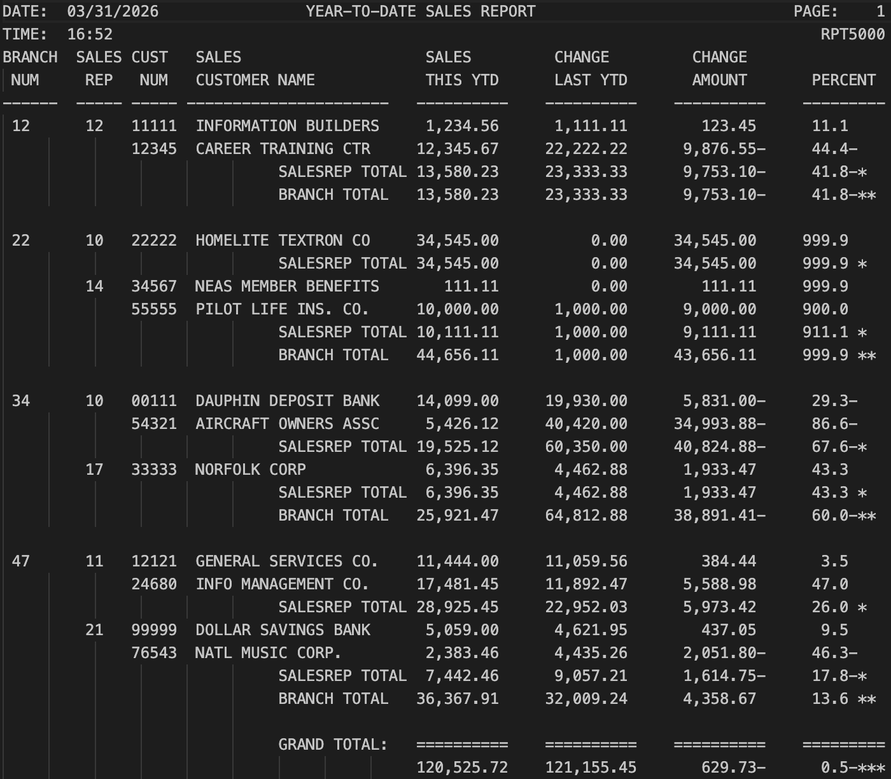
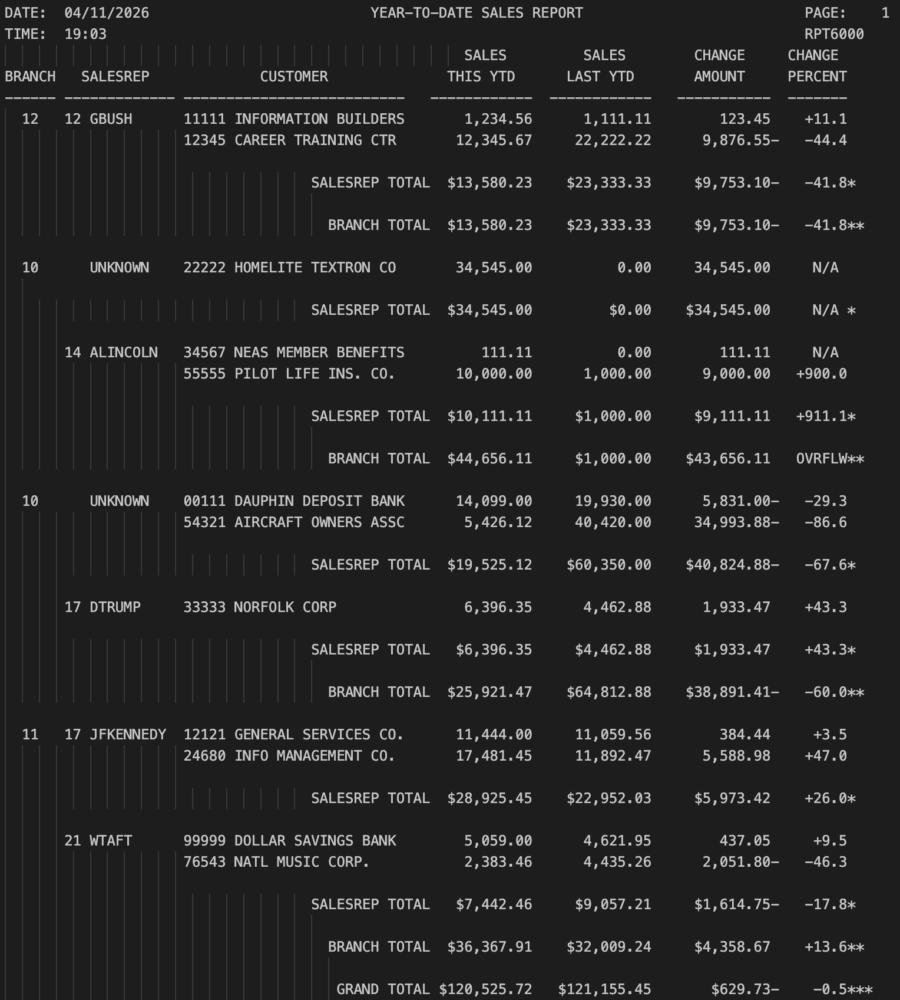

# Developer Portfolio Gateway
**Author:** Clay Rasmussen  
**Course:** CIS352 – Intro to Enterprise Computing  

---

## 👋 About Me
**Welcome to my GitHub portfolio repository!**
I am currently studying Computer Information Systems at Wayne State College.  
This repository serves as a central directory for navigating my coursework and projects.

---

## 📸 Profile

  

<h3 align="center">Clay Rasmussen</h3>

  <a href="https://github.com/Clay-Rasmussen">GitHub</a> •
  <a href="mailto:clrasm02@wsc.edu">Email</a> •
  <a href="https://www.linkedin.com/in/clayrasmussen/">LinkedIn</a>

## 📚 Table of Contents

| Project | Tech | Category | Description |
|---------|------|----------|-------------|
| [CALC2000](#calc2000) | COBOL / JCL | Intro to Enterprise Computing | Calculate Future Value |
| [UTIL2000](#util2000) | COBOL / JCL | Intro to Enterprise Computing | Formatted Year-To-Date (YTD) Sales Report |
| [RPT2000](#rpt2000) | COBOL / JCL | Intro to Enterprise Computing | description... |
| [RPT3000](#rpt3000) | COBOL / JCL | Intro to Enterprise Computing | description... |
| [RPT5000](#rpt5000) | COBOL / JCL | Intro to Enterprise Computing | description... |
| [RPT6000](#rpt6000) | COBOL / JCL | Intro to Enterprise Computing | description... |
| [SEQ3000](#seq3000) | COBOL / JCL | Intro to Enterprise Computing | description... |
| [Weather Station](#weather-station) | Java | Programming Fundamentals II | description... |
| [MathTutorV6](#mathtutorv6) | C++ | Programming Fundamentals I | description... |

---

## CALC2000
A COBOL batch program that calculates future investment values and demonstrates repeated value doubling.

**Key Concepts:** Arithmetic ops  |  Data Division handling  |  Output formatting  |  Future value calc  |  Repeated doubling

**Tech Stack:**   

✅ Completed 
[Repo](https://github.com/Clay-Rasmussen/COBOLCALC2000)

 

🔙 [Back to TOC](#-table-of-contents)

---

## CALC2000

### 📌 Summary
A COBOL batch program that calculates future investment values and demonstrates 
repeated value doubling through structured processing.

### 🧰 Tech Stack

### 🧠 Key Concepts & Features
- Arithmetic operations in COBOL
- `Data handling` in the `Data Division`
- Output formatting for financial results
- Calculates `future value` of an investment
- Demonstrates `repeated doubling` of values

### 🚦 Status
✅ Completed

### 📷 Preview
  

### 🔗 Repository
[CALC2000](https://github.com/Clay-Rasmussen/COBOLCALC2000)

🔙 [Back to TOC](#-table-of-contents)
---

## UTIL2000

### 📌 Summary
A COBOL utility billing system that calculates and generates monthly bills for multiple customers based on their kilowatt-hour (kWh) usage.

### 🧰 Tech Stack

### 🧠 Key Concepts & Features
- Arithmetic calculations for billing
- `Conditional` logic for rate calculations
- Calculates monthly billing based on `kWh consumption`
- Generates `formatted` billing output
- Handles `multiple customer records` in a single run

### 🚦 Status
✅ Completed

### 📷 Preview
  

### 🔗 Repository
[UTIL2000](https://github.com/Clay-Rasmussen/CobolUtil2000)

🔙 [Back to TOC](#-table-of-contents)
---

## RPT2000

### 📌 Summary
An intermediate COBOL reporting program that processes customer financial records and generates a formatted Year-To-Date (YTD) Sales Report. This version introduces comparative analytics by calculating differences between current and previous year sales.

### 🧰 Tech Stack

### 🧠 Key Concepts & Features
- Arithmetic operations using `COMPUTE` and `SUBTRACT`
- Percentage calculations with zero-division protection
- Reads customer data from `CUSTMAST`
- Calculates `YTD change amount` and `percentage`
- Generates formatted multi-column reports

### 🚦 Status
✅ Completed

### 📷 Preview
  
  
### 🔗 Repository
[RPT2000](https://github.com/Clay-Rasmussen/RPT2000)

🔙 [Back to TOC](#-table-of-contents)
---

## RPT3000

### 📌 Summary
An advanced COBOL reporting tool that processes customer financial records from a master file and generates a formatted multi-page Year-To-Date (YTD) Sales Report. The program includes automated branch break processing, customer-level calculations, and professional report pagination.

### 🧰 Tech Stack

### 🧠 Key Concepts & Features
- `First-record` switch handling
- Running totals and grand totals
- Multi-page output pagination
- Reads customer financial data from `CUSTMAST`
- Calculates `YTD change amount` and `percentage`
- Adds formatted headers, timestamps, and separators

### 🚦 Status
✅ Completed

### 📷 Preview
  

### 🔗 Repository
[RPT3000](https://github.com/Clay-Rasmussen/RPT3000)

🔙 [Back to TOC](#-table-of-contents)
---

## RPT5000

### 📌 Summary
An advanced COBOL reporting system that processes customer sales data and generates a multi-level, formatted Year-To-Date (YTD) Sales Report. This version introduces two-level control break processing, enhanced decision logic using EVALUATE, and professional report pagination.

### 🧰 Tech Stack

### 🧠 Key Concepts & Features
- Two-level control break processing (branch & sales representative)
- `EVALUATE` statement for structured decision-making
- 88-level condition names for readable logic control
- Error-handled arithmetic using `COMPUTE`, `ROUNDED`, and `ON SIZE ERROR`
- Generates nested subtotal reports by branch and sales representative
- Produces clean, multi-page formatted reports with headers and spacing

### 🚦 Status
✅ Completed

### 📷 Preview
  

### 🔗 Repository
[RPT5000](https://github.com/Clay-Rasmussen/RPT5000)

🔙 [Back to TOC](#-table-of-contents)
---

## RPT6000

### 📌 Summary
An advanced COBOL program focused on data formatting, table processing, and modular design. This project integrates file-driven tables, indexed lookups, and reusable copybooks to enhance flexibility, scalability, and report accuracy.

### 🧰 Tech Stack

### 🧠 Key Concepts & Features
- `REDEFINES` and edited picture clauses for formatted output
- Table processing using `OCCURS` and `INDEXED BY`
- `SEARCH` statement for table lookups
- Copybooks `(COPYLIB)` for modular design
- Performs indexed lookups for sales representative information

### 🚦 Status
✅ Completed

### 📷 Preview
  

### 🔗 Repository
[RPT6000](https://github.com/Clay-Rasmussen/RPT6000)

🔙 [Back to TOC](#-table-of-contents)
---

## SEQ3000

### 📌 Summary
A COBOL file maintenance program that processes employee master records alongside a transaction file to perform additions, deletions, and updates. The program uses a balanced-line algorithm to ensure accurate record comparison and generates both an updated master file and an error report.

### 🧰 Tech Stack

### 🧠 Key Concepts & Features
- Multi-file `input/output` and error handling
- Structured program flow for record maintenance
- Processes employee master and transaction files simultaneously
- Performs `add`, `delete`, and `update` operations
- Generates updated master file

### 🚦 Status
✅ Completed

### 📷 Preview
  

### 🔗 Repository
[SEQ3000](https://github.com/Clay-Rasmussen/SEQ3000)

🔙 [Back to TOC](#-table-of-contents)
---

## Weather Station

### 📌 Summary
A Java application that displays real-time weather station data, including temperature, humidity, and wind speed. This project demonstrates object-oriented programming concepts and UI/data handling using instructor-provided starter code.

### 🧰 Tech Stack

### 🧠 Key Concepts & Features
- `Object-oriented` programming (classes and objects)
- Event-driven or input-based updates (depending on implementation)
- Displays `temperature`, `humidity`, and `wind speed`
- Processes and presents weather data in a user-friendly format

### 🚦 Status
✅ Completed

### 🔗 Repository
[Weather Station](https://github.com/Clay-Rasmussen/Semester2JavaFinal)

🔙 [Back to TOC](#-table-of-contents)
---

## MathTutorV6

### 📌 Summary
A C++ console-based math tutor application that generates random arithmetic problems and adjusts difficulty based on user performance. The program tracks attempts, provides feedback, and summarizes results to enhance learning.

### 🧰 Tech Stack

### 🧠 Key Concepts & Features
- `Random` number generation
- Use of vectors for storing results
- `Enum` usage for math operation types
- Generates random math problems (addition, subtraction, etc.)
- Adjusts difficulty level based on performance

### 🚦 Status
✅ Completed

### 🔗 Repository
[MathTutorV6](https://github.com/Clay-Rasmussen/MathTutorV6)

🔙 [Back to TOC](#-table-of-contents)
---
