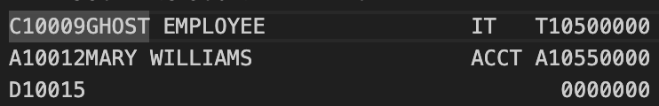
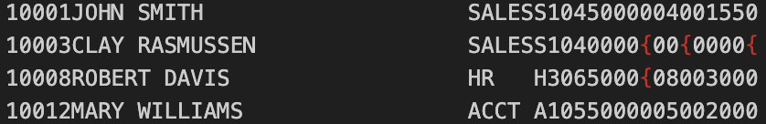

# Developer Portfolio Gateway
**Author:** Clay Rasmussen  
**Course:** CIS352 – Intro to Enterprise Computing

---

## 👋 About Me
**Welcome to my GitHub portfolio repository!**
I am currently studying Computer Information Systems at Wayne State College.  
This repository serves as a central directory for navigating my coursework and projects.

---

## 📸 Profile

  

<h3 align="center">Clay Rasmussen</h3>

  <a href="https://github.com/Clay-Rasmussen">GitHub</a> •
  <a href="mailto:clrasm02@wsc.edu">Email</a> •
  <a href="https://www.linkedin.com/in/clayrasmussen/">LinkedIn</a>

## 📚 Table of Contents

| Project Summary | Tech | Category | Description | Repo |
|---------|------|----------|-------------|------|
| [CALC2000](#calc2000) | COBOL / JCL | Intro to Enterprise Computing | Calculates future investment values using compound growth and repeated doubling logic | [COBOLCALC2000](https://github.com/Clay-Rasmussen/COBOLCALC2000) |
| [UTIL2000](#util2000) | COBOL / JCL | Intro to Enterprise Computing | Generates formatted monthly utility bills based on customer kWh usage | [UTIL2000](https://github.com/Clay-Rasmussen/CobolUtil2000)|
| [RPT2000](#rpt2000) | COBOL / JCL | Intro to Enterprise Computing | Produces a YTD sales report with year-over-year comparison and percent change calculations | [RPT2000](https://github.com/Clay-Rasmussen/RPT2000)|
| [RPT3000](#rpt3000) | COBOL / JCL | Intro to Enterprise Computing | Creates multi-page YTD sales reports with branch-level control breaks and pagination | [RPT3000](https://github.com/Clay-Rasmussen/RPT3000)|
| [RPT5000](#rpt5000) | COBOL / JCL | Intro to Enterprise Computing | Advanced reporting system with two-level control breaks and structured decision logic | [RPT5000](https://github.com/Clay-Rasmussen/RPT5000)|
| [RPT6000](#rpt6000) | COBOL / JCL | Intro to Enterprise Computing | Implements table-driven processing with indexed lookups and modular copybooks | [RPT6000](https://github.com/Clay-Rasmussen/RPT6000)|
| [SEQ3000](#seq3000) | COBOL / JCL | Intro to Enterprise Computing | Maintains employee records by processing transactions for add, update, and delete operations | [SEQ3000](https://github.com/Clay-Rasmussen/SEQ3000)|
| [Weather Station](#weather-station) | Java | Programming Fundamentals II | Displays real-time weather data using object-oriented design and user-friendly output | [Weather Station](https://github.com/Clay-Rasmussen/Semester2JavaFinal) |
| [MathTutorV6](#mathtutorv6) | C++ | Programming Fundamentals I | Interactive math tutor that adapts difficulty and tracks user performance | [MathTutorV6](https://github.com/Clay-Rasmussen/MathTutorV6) |

---

## CALC2000
A `COBOL` batch program that calculates `future investment values` and demonstrates `repeated value doubling`.

**Key Concepts:** Arithmetic ops  |  Data Division handling  |  Output formatting  |  Future value calc  |  Repeated doubling

**Tech Stack:** 

✅ Completed 
[CALC2000 Repo](https://github.com/Clay-Rasmussen/COBOLCALC2000)

 

🔙 [Back to TOC](#-table-of-contents)

---

## UTIL2000
A `COBOL` utility billing system that `calculates` and `generates` monthly `bills` for `multiple customers` based on their `kilowatt-hour (kWh) usage`.

**Key Concepts:** Arithmetic calculations | Conditional logic | kWh Consumption | Formatted Output | Multi-record Processing

**Tech Stack:** 

✅ Completed
[UTIL2000 Repo](https://github.com/Clay-Rasmussen/CobolUtil2000)

🔙 [Back to TOC](#-table-of-contents)

---

## RPT2000
An intermediate `COBOL` reporting program that processes `customer financial records` and `generates` a `formatted Year-To-Date (YTD) Sales Report`. This version introduces comparative analytics by
calculating differences between current and previous year sales.

**Key Concepts:** COMPUTE/SUBTRACT | Percent Calculations | File processing | YTD Comparrison

**Tech Stack:** 

✅ Completed
[RPT2000 Repo](https://github.com/Clay-Rasmussen/RPT2000)

🔙 [Back to TOC](#-table-of-contents)
---

## RPT3000
A `COBOL` reporting tool that `processes customer financial records` from a master file and `generates a formatted multi-page Year-To-Date (YTD) Sales Report`. The program includes `automated branch
break processing`, `customer-level calculations`, and professional `report pagination`.

**Key Concepts:** First-record switch | CUSTMAST data file | YTD change amount and Percent

**Tech Stack:** 

✅ Completed
[RPT3000 Repo](https://github.com/Clay-Rasmussen/RPT3000)

🔙 [Back to TOC](#-table-of-contents)
---

## RPT5000
A `COBOL` reporting system that `processes customer sales data` and `generates a multi-level, formatted Year-To-Date (YTD) Sales Report`. This version introduces `two-level control break processing`, enhanced `decision logic using EVALUATE`, and professional `report pagination`.

**Key Concepts:** Two-Level control break | EVALUATE | 88-Level condition names | COMPUTE, ROUNDED, ON SIZE ERROR

**Tech Stack:** 

✅ Completed
[RPT5000 Repo](https://github.com/Clay-Rasmussen/RPT5000)

🔙 [Back to TOC](#-table-of-contents)
---

## RPT6000
An advanced `COBOL` program focused on `data formatting`, `table processing`, and `modular design`. This project introduces `file-driven tables`, `indexed lookups`, and `reusable copybooks` to enhance flexibility, scalability, and report accuracy.

**Key Concepts:** REDEFINES | Edited Pic Clause | Table Processing with OCCURES and INDEXED BY | COPYLIB

**Tech Stack:** 

✅ Completed
[RPT6000 Repo](https://github.com/Clay-Rasmussen/RPT6000)

🔙 [Back to TOC](#-table-of-contents)
---

## SEQ3000
A `COBOL` file maintenance program that `processes employee master records` alongside a `transaction file` to perform `additions, deletions, and updates`. The program uses a balanced-line algorithm to ensure `accurate record comparison` and `generates` both an `updated master file and an error report`.

**Key Concepts:** Multi-file i/o | Error Handling | Add, Delete, and Update Operations | Generates Updated Master File

**Tech Stack:** 

### 🚦 Status
✅ Completed
[SEQ3000 Repo](https://github.com/Clay-Rasmussen/SEQ3000)

**Error Catching File**

**Employee File**

 

🔙 [Back to TOC](#-table-of-contents)
---

## Weather Station
A `Java` application that displays `real-time weather station data`, including `temperature, humidity, and wind speed`. This project demonstrates `object-oriented programming` concepts and `UI/data handling` using instructor-provided starter code.

**Key Concepts:** Object-Oriented Programming | Temperature | Humidity | Wind Speed | User-Friendly Format

**Tech Stack:**

✅ Completed
[WeatherStation Repo](https://github.com/Clay-Rasmussen/Semester2JavaFinal)

🔙 [Back to TOC](#-table-of-contents)
---

## MathTutorV6

### 📌 Summary
A `C++` console-based `math tutor application` that `generates random arithmetic problems` and `adjusts difficulty` based on user performance. The program tracks `attempts, provides feedback, and summarizes results` to enhance learning.

**Key Concepts:** Random number generation | Vectors for storage | Enum's for math type | Random math Problems | Adjustable difficulty

**Tech Stack:** 

✅ Completed
[MathTutor Repo](https://github.com/Clay-Rasmussen/MathTutorV6)

🔙 [Back to TOC](#-table-of-contents)
---
